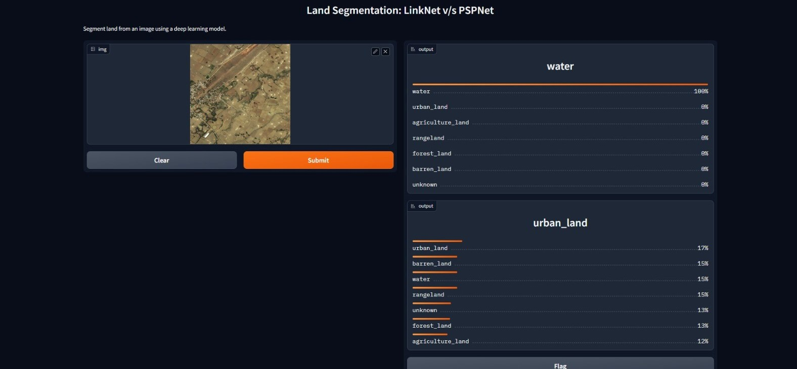

# Land Cover Mapping using Semantic Segmentation Models
* Segmenting land from an image using a deep learning model.
* This application aims to provide a user-friendly interface for segmenting land areas in images.
* Firstly we get an intermediate output as a segmented image of the land cover, which is later converted into the percentage of the respective land classes.
* Overall, we aim to make land segmentation accessible to a wide range of users and facilitating further analysis and decision-making based on the segmented land regions

* [Gradio App](https://huggingface.co/spaces/812vaishnavi/gradio-land-cover-mapping)

  
   
   
  
   
   
  
